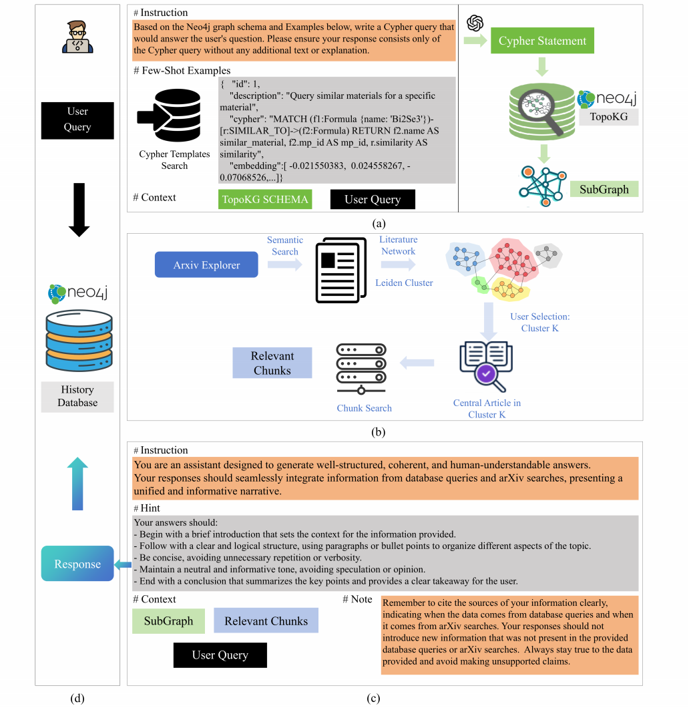
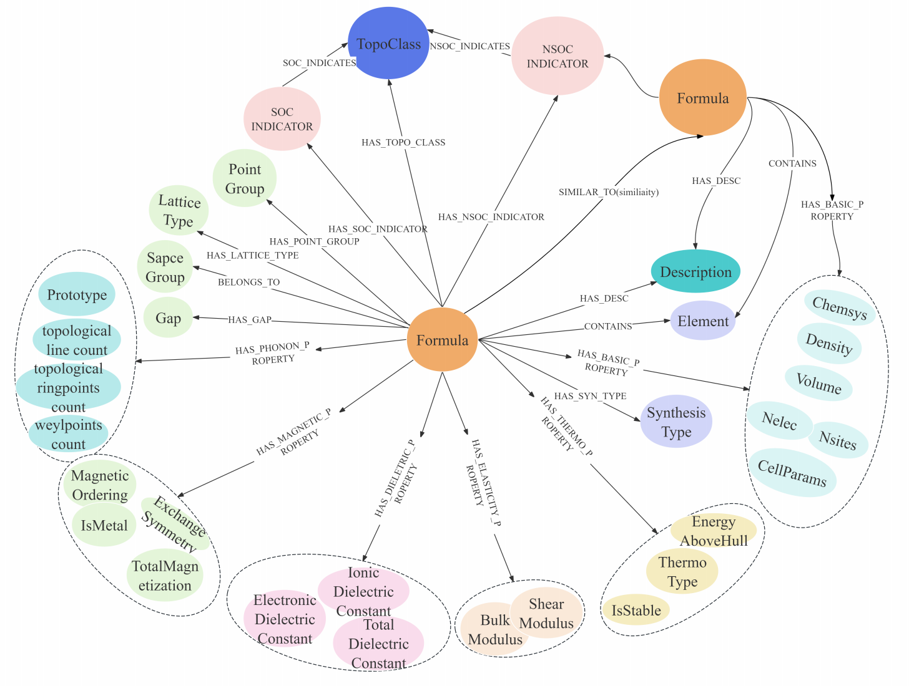
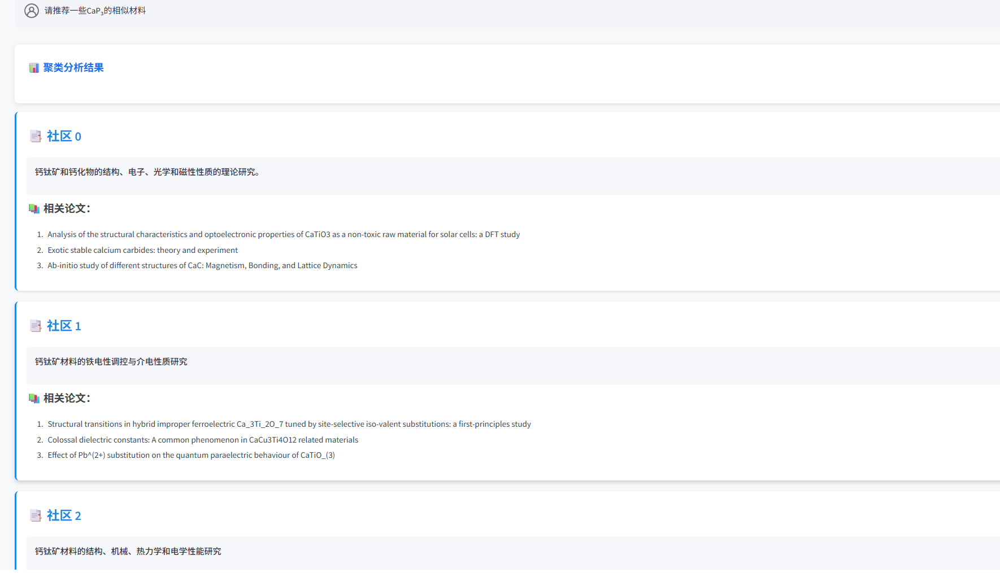
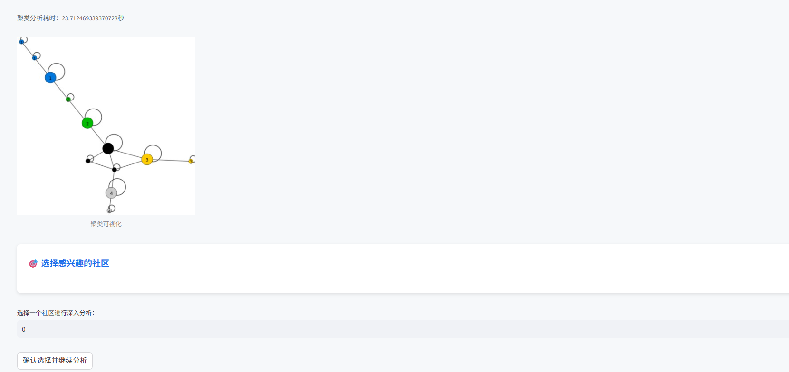
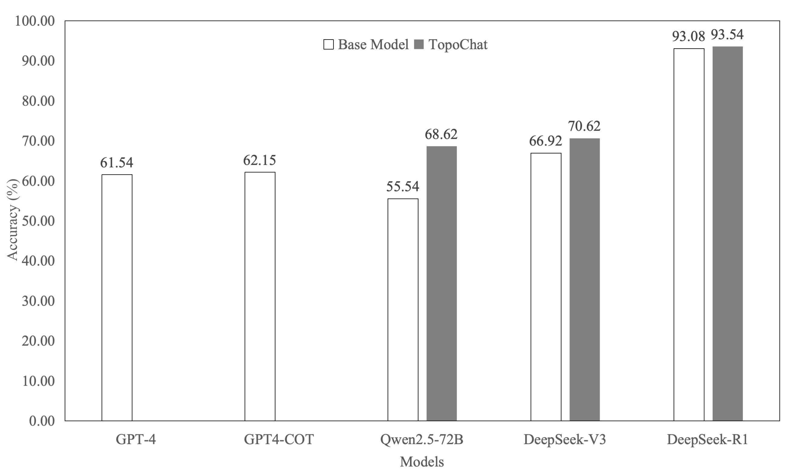
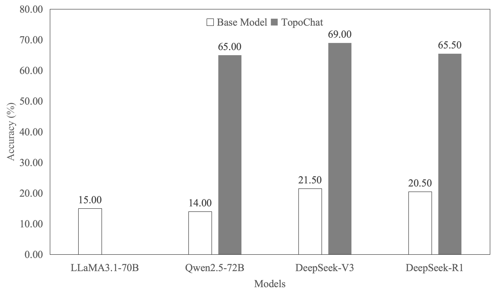
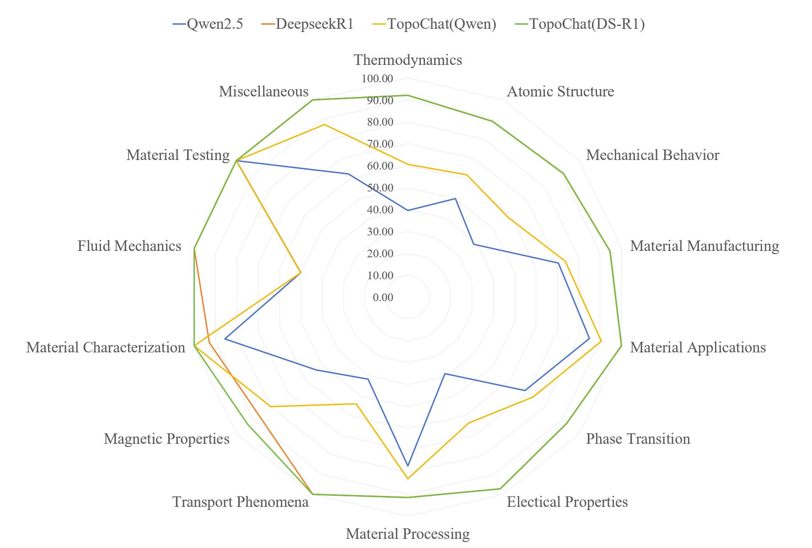

# TopoChat: Enhancing Topological Materials Retrieval with Large Language Models and Multi-Source Knowledge

## Overview
TopoChat is a hybrid intelligent question-answering system tailored for materials science. It integrates structured knowledge from the TopoKG knowledge graph and unstructured knowledge from scientific literature to support reasoning and answer generation by LLMs.


## System Architecture



> **Figure 1**: Overview of TopoChat. The four principal stages are illustrated:  
> (a) graph database retrieval,  
> (b) literature retrieval,  
> (c) response prompt design,  
> (d) response generation and history persistence.


## System Design
The system is built on a hybrid architecture combining:
1. Knowledge Graph integration using langchain's [neo4j-cypher-memory](https://python.langchain.com.cn/docs/templates/neo4j-cypher-memory)  
2. Literature analysis powered by [arXiv Xplorer](https://arxivxplorer.com/) and Leiden Cluster Algorithm
3. Intelligent query processing and response generation

### Topological Materials Knowledge Graph (TopoKG)
- Built upon [CMPDC](https://cmpdc.iphy.ac.cn/) and [Materials Project](https://materialsproject.org/) databases
- Incorporates structural descriptions generated by Robocrystallographer 
- Current scale (until 2024/11/13):
  - 192,000+ nodes
  - 825,000+ relationships


> **Figure 2**: Visualization of TopoKG centered on the Formula node, where nodes(colored by type) represent different material characteristics and edges show various relationships.

### Literature Analysis 
- Implements arXiv Xplorer for initial literature retrieval
- Uses Leiden clustering algorithm for community detection
- Automatically identifies central papers within user-selected research communities
- Provides contextualized responses based on relevant literature



> **Figure 3**: Example of Literature Cluster Algorithm in TopoChat.

### Response Generation
The system generates comprehensive responses by combining:
- Knowledge graph query results
- Relevant literature analysis 
- Expert-level synthesis of information

## Installation

### Prerequisites
- Python 3.10.14
- Neo4j Database(need apoc plugin)
- Additional dependencies 

### Setup
#### Step 1: Import Knowledge Graph Data
1. Import MaterialsKG data using APOC in Neo4j:
```cypher
CALL apoc.import.graphml("materialskg_export.graphml", {readLabels:true})
```
2. Import conversation history data:
```cypher
CALL apoc.import.graphml("history_export.graphml", {readLabels:true})
```
3. Configure Neo4j Database Connection (in chain.py):

```python
graph = Neo4jGraph(
    url=NEO4J_URI, username=NEO4J_USER, password=NEO4J_PASSWORD, database="neo4j"
)

history_graph = Neo4jGraph(
    url=NEO4J_URI, username=NEO4J_USER, password=NEO4J_PASSWORD, database="history"
)
```
4. Start Neo4j database service

#### Step 2: Launch Application
```bash
conda env create -f environment.yml

cd materialschat/matapp/packages/neo4j-cypher-memory

streamlit run app.py
```
Access the interface at: http://localhost:8501/


> **Figure 4**: TopoChat Streamlit Application.

## Evaluation 
To evaluate the effectiveness of TopoChat in answering domain-specific questions in materials science, we conducted experiments on two benchmark datasets: **MaScQA** and **TopoQA**. These datasets were designed to test the reasoning and retrieval capabilities of language models in complex scientific scenarios.

#### MaScQA

The [MaScQA](https://github.com/M3RG-IITD/MaScQA) dataset consists of **650 challenging questions** from the materials science domain. Questions are categorized by subfields such as *thermodynamics*, *electrical properties*, and *mechanical behavior*, and span various question formats:

- **Multiple-choice questions (MCQS)**: 284 questions  
- **Numerical answer questions (NUM)**: 228 questions  
- **Matching questions (MATCH)**: 70 questions  
- **Multiple-choice questions with numerical answers (MCQS-NUM)**: 68 questions

This dataset evaluates the model's ability to understand structured scientific concepts and perform quantitative reasoning.

#### TopoQA

The TopoQA dataset targets the subdomain of *crystallographic and topological properties* of materials. It includes **200 questions** in both single-choice and fill-in-the-blank formats. The questions cover:

- Space groups  
- Crystal systems  
- Symmetry groups  
- Band gaps  
- Topological classifications

TopoQA emphasizes the model’s understanding of structural and topological descriptors that are critical in materials discovery.


The datasets and evaluation results are publicly available and can be downloaded from:

🔗 [https://zenodo.org/records/14506502](https://zenodo.org/records/14506502)

#### Performance 


> **Figure 5**: Performance comparison between different base models and their TopoChat-enhanced counterparts. Top: MaScQA, bottom: TopoQA.


> **Figure 6**: Radar chart comparing the accuracy of different models across various materials science topics in MaScQA. Each axis represents a specific topic, and the radial scale indicates accuracy.

## Citation
If you use TopoChat in your research, please cite:

> Huang-Chao Xu, Bao-Hua Zhang, Zhong Jin, Tian-Nian Zhu, Quan-Sheng Wu, Hong-Ming Weng. TopoChat: Enhancing Topological Materials Retrieval with Large Language Models and Multi-Source Knowledge[J]. Journal of Computer Science and Technology. DOI: 10.1007/s11390-025-5113-9

## Contact
hcxu@cnic.cn

zhangbh@sccas.cn